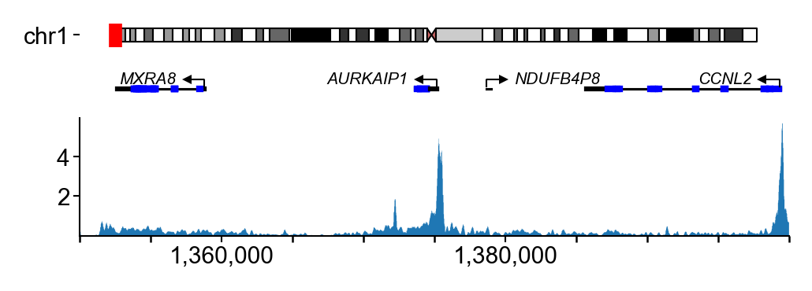
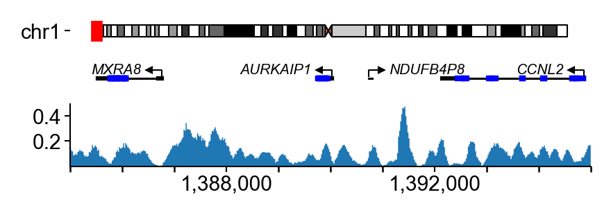
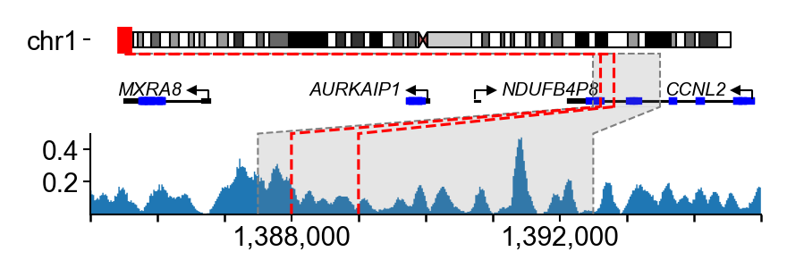
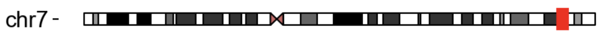
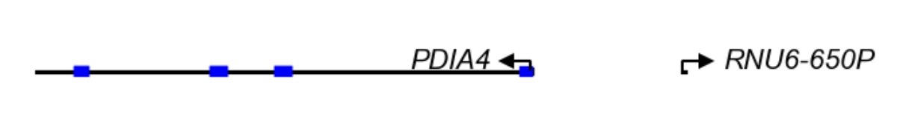
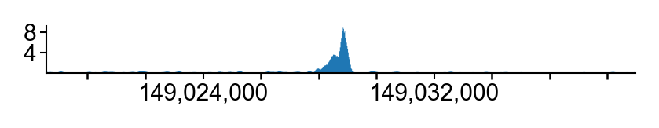

# Modular Plot Framework
The modular plot framework provides a flexible, composable system for creating complex genomic interval visualizations. It separates data loading from plotting logic, enabling reusable components that can be easily combined and configured. Details on individual components along with examples can be found in PlotComponents section

# Key concepts
- **IntervalPlotter**: The main orchestrator that manages components and creates figures

- **IntervalPlotComponent**: A plot component that renders data for a genomic interval

- **PlotDataLoader**: A data loader that fetches and processes data for components

- **DataBundle**: A container that holds data passed between loaders and components

# Basic functionality
## Quick start

```python
from genome_tools import GenomicInterval
from genome_tools.plotting.modular_plot import IntervalPlotter
from genome_tools.plotting.modular_plot.plot_components.basic import (
    IdeogramComponent,
    GencodeComponent,
    TrackComponent,
)
from genome_tools.plotting.ideogram import read_ideogram

# Define the genomic interval to visualize
interval = GenomicInterval('chr1', 1_350_000, 1_400_000)

signal_file = '/net/seq/data2/projects/ENCODE4Plus/REGULOME/per_sample//AG80080/AG80080.normalized_density.bw'
gencode_file = '/home/sabramov/projects/ENCODE4/gencode/gencode.v42.basic.annotation.gtf.gz'
ideogram_file = '/home/sabramov/projects/extraData/cytoBandIdeo.txt'

# Define plot components with their heights and margins
plot_components = [
    IdeogramComponent(height=0.1, margins=0),
    GencodeComponent(height=0.2, margins=0),
    TrackComponent(height=0.5, margins=(0.1, 0.1)),
]

# Create the plotter
plotter = IntervalPlotter(
    plot_components,
    signal_file=signal_file,  # Required by TrackComponent
    gencode_annotation_file=gencode_file,  # Required by GencodeComponent
    ideogram_data=read_ideogram(ideogram_file),  # Required by IdeogramComponent (pre-loaded object)
)

# Plot in one step (load data + plot)
data, axes = plotter.plot(
    interval,
    fig_width=3
)
```


## Two-step workflow (load then plot)

For more control, separate data loading from plotting:

```python
# Step 1: Load data
data = plotter.get_interval_data(
    interval,
)

# Step 2: Plot the data
axes = plotter.plot_interval(data, fig_width=3)
```


This is useful when you want to either cache data for interactive exploration
or debug data loading separately from plotting

## Different intervals for components

Components can visualize different genomic intervals using `interval_key`:

```python
# Components with different interval keys
plot_components = [
    IdeogramComponent(height=0.1, interval_key='gene', margins=0),
    GencodeComponent(height=0.2, interval_key='gene', margins=0),
    TrackComponent(height=0.3, interval_key='zoomed'),
]

plotter = IntervalPlotter(
    plot_components,
    signal_file=signal_file,
    gencode_annotation_file=gencode_file,
    ideogram_data=read_ideogram(ideogram_file),
)

# Provide a dict of intervals
intervals = {
    'gene': GenomicInterval('chr1', 1_350_000, 1_400_000),
    'zoomed': GenomicInterval('chr1', 1_385_000, 1_395_000),  # Zoomed in
}

data, axes = plotter.plot(
    intervals,
)
```


## Adding connectors

Connect components with lines or shaded areas to highlight specific regions:

```python
# Plot the interval
data, axes = plotter.plot(intervals)
highlight_interval = intervals['zoomed'].zoom(2)

# Add an area connector highlighting a regulatory region
plotter.plot_connector(
    axes,
    interval=highlight_interval,
    end_component='TrackComponent',
    type='area',
    alpha=0.2,
    extend_to_top=False,
    extend_to_bottom=True,
)

plotter.plot_connector(
    axes,
    interval=highlight_interval,
    end_component='TrackComponent',
    type='line',
    ls='--',
    linewidth=0.5,
    c='grey',
    extend_to_bottom=True,
)

# Add line connectors at specific positions
plotter.plot_connector(
    axes,
    positions=[1_388_000, 1_389_000],
    extend_to_bottom=True,
    extend_to_top=False,
    type='line',
    c='red'
)
```


**Connector types:**
- `'area'` - Shaded region between two x-coordinates (requires `interval` or `positions=[start, end]`)
- `'line'` - Vertical lines at specific positions (requires `positions=[x1, x2, ...]`, `interval` gets converted to `[x1, x2]`)

## (Not fully tested) Parallel Data Loading

For large datasets or slow loaders, enable parallel processing:

```python
data, axes = plotter.plot(
    interval,
    n_cpus=4,  # Use 4 processes for data loading
    **loader_kwargs
)
```

**Note:** Due to multiprocessing overhead, parallel loading may be slower for fast loaders. Best for I/O-bound operations.

# Available Plot Components

## Basic Components

### **IdeogramComponent**
Displays chromosome ideogram with cytobands.

**Loaders:** `IdeogramLoader`

**Required arguments:**
- `ideogram_data` dict: Result of `genome_tools.plotting.ideogram.read_ideogram()`

**Example:**
```python
from genome_tools.plotting.modular_plot.plot_components.basic import IdeogramComponent
ideogram_file = '/home/sabramov/projects/extraData/cytoBandIdeo.txt'
IdeogramComponent(
    height=0.1,
    margins=(0.1, 0.0),
    ideogram_data=read_ideogram(ideogram_file),
)
```


### **GencodeComponent**
Plots gene annotations from GENCODE GTF files.

**Loaders:** `GencodeLoader`

**Required arguments:**
- `gencode_annotation_file` (str): Path to GENCODE GTF file

**Optional plotting arguments:**
- `gene_symbol_exclude_regex` (str): Regex to exclude certain gene symbols (default: `r'^ENSG|^MIR|^LINC|.*-AS.*'`)

**Example:**
```python
from genome_tools.plotting.modular_plot.plot_components.basic import GencodeComponent

gencode_file = '/home/sabramov/projects/ENCODE4/gencode/gencode.v42.basic.annotation.gtf.gz'
GencodeComponent(
    height=0.3,
    margins=(0.05, 0.05),
    gencode_annotation_file=gencode_file,
    gene_symbol_exclude_regex=r'^ENSG',  # Exclude Ensembl IDs
)
```


### **TrackComponent**
Plots signal track from bigWig files.

**Loaders:** `SignalLoader`

**Required arguments:**
- `signal_file` (str): Path to bigwig file

**Example:**
```python
from genome_tools.plotting.modular_plot.plot_components.basic import TrackComponent
signal_file = '/net/seq/data2/projects/ENCODE4Plus/REGULOME/per_sample//AG80080/AG80080.normalized_density.bw'
TrackComponent(
    height=1.5,
    margins=(0.1, 0.1),
    signal_file=signal_file,
)
```


## Sequence Components. API might be not up to date

### **SequencePlotComponent**
Plots DNA sequence as colored nucleotides.

**Loaders:** `FastaLoader`, `OHESequenceLoader`

**Required arguments:**
- `fasta_file` (str): Path to genome FASTA file

**Optional plotting arguments:**
- `vocab` (dict): Dictionary for vocabulary ({letter: color}). Expected order of keys is ACGT. E.g. `vocab = {x: 'k' for x in ACGT}` to plot all letters as black

**Example:**
```python
from genome_tools.plotting.modular_plot.plot_components.sequence import SequencePlotComponent

fasta_file='/net/seq/data/genomes/human/GRCh38/noalts/GRCh38_no_alts.fa'

SequencePlotComponent(
    height=0.2,
    fasta_file=fasta_file,
)
```

### Motif hits components
These section describes the `MotifHitsComponent` and it's derivatives with various motif selection criteria

#### MotifHitsComponent
Base component that displays transcription factor motif hits as sequence logos.

**Loaders:** `AnnotationRegionsLoader`, `MotifHitsLoader`, `MotifHitsSelectorLoader`

**Required arguments:**
- `annotation_regions` (List[GenomicInterval]): Regions to search for motifs
- `motif_annotations_path` (str): Path to motif hits tabix file. Has a `motif_id` column
- `motif_meta` (pd.DataFrame): DataFrame with `motif_id` set as index 

**Optional loader arguments:**
- `min_motif_overlap`: Minimal overlap of motif hit and any annotation_region (default 0.9)
- `choose_by`: metric to sort motif hits by. This component has only basic `ΔG` scoring (default: 'dg')
- `motif_hits_threshold`: lower bound of metric (as defined by `choose_by`) (default: None)
- `n_top_hits`: # of top motif hits per annotation region. (default: 1)

**Optional plotting arguments:**
- `pack` (bool): Whether to pack overlapping motifs into non-overlapping rows (similar to `genome_tools.plotting.segment_plot`). Useful when extracting several motifs per region. (default: False)

**Example:**
```python
from genome_tools.plotting.modular_plot.plot_components.sequence import MotifHitsComponent

motif_annotations_path = '/net/seq/data2/projects/sabramov/ENCODE4/dnase-genotypes.v4/round1/output/moods_scans_ref.merged.sorted.bed.gz'   # tabix-indexed annotations. Motif hits at 1e-4 p-value
motif_meta_df = pd.read_table('/home/sabramov/projects/ENCODE4/ENCODE4_DHS/metadata/source/motifs_meta.tsv').set_index('motif_id')
min_motif_overlap = 0.8
n_top_hits = 2

annotation_regions=[GenomicInterval('chr1', 1_000_000, 1_000_020)]

MotifHitsComponent(
    height=0.5,
    annotation_regions=annotation_regions,
    motif_annotations_path=motif_annotations_path,
    motif_meta=motif_meta_df,  # DataFrame indexed by motif_id with metadata
    pack=True,
    choose_by='dg',
    min_motif_overlap=min_motif_overlap,
    n_top_hits=2
)
```
TODO: Add example

#### VariantDdgMotifHitsComponent
Extension of MotifHitsComponent. Has two alternative methods for choosing best motif hits -
`choose_by='ddg'` or `choose_by='concordant_ddg'`. The best motif hit is chosen based on the highest change in dg caused by a variant. For `concordant_ddg` the `variant_interval.value` is used for inferring the sign. 

**Loaders:** `VariantIntervalLoader`, `AnnotationRegionsLoader`, `MotifHitsLoader`, `MotifHitsSelectorLoader`

**Required loader arguments**
`variant_interval`: `genome_tools.VariantInterval` - variant interval based on which alleles and position the delta dg score is calculated. Should be within `data.interval`

```python
from genome_tools import VariantInterval
from genome_tools.plotting.modular_plot.plot_components.sequence import VariantDdgMotifHitsComponent

variant_interval = VariantInterval(
    'chr1', 1_000_005, 1_000_006,
    ref='A',
    alt='G',
    value=1.3
)

VariantDdgMotifHitsComponent(
    height=0.5,
    motif_annotations_path=motif_annotations_path,
    motif_meta=motif_meta_df,  # DataFrame indexed by motif_id with metadata
    pack=True,
    choose_by='ddg',
    min_motif_overlap=min_motif_overlap,
    n_top_hits=2
)

plotter.plot(
    dhs_interval,
    loaders_kwargs=dict(
        variant_interval=variant_interval,
        annotation_regions=annotation_regions,
    )
)
```

TODO: Add example image
#### FPWeightedMotifHitsComponent

Extension of MotifHitsComponent. Has an alternative method for choosing best motif hits -
`choose_by='weighted_dg'`. In this case heights of the TF protected nucleotides treated as per-position weights (see [TFProtectedNucleotidesComponent](#TFProtectedNucleotidesComponent) for more details)

! Note: weighted_dg works only if motif hits *fully* overlap `data.interval`. The motif hits on the edges of the `data.interval` are filtered out.

**Loaders:** `PosteriorLoader`, `FastaLoader`, `ProtectedNucleotidesLoader`, `AnnotationRegionsLoader`, `SequenceWeightsFromProtectedNucleotidesLoader`, `MotifHitsLoader`, `MotifHitsSelectorLoader`

**Optional loader arguments**

In addition to [MotifHitsComponent](#MotifHitsComponent) loader arguments the following options are available:
`protected_nuc_sample_ids`: subset of sample_ids to take into account when calculating protected nucleotides (useful when want to get protected nucleotides only for a subset of samples, e.g. a certain cell type). (default: None)
`posterior_threshold`: threshold to binarize the posterior probabilities (default: 0.99)


**Example:**
```python
from genome_tools.plotting.modular_plot.plot_components.footprint import FPWeightedMotifHitsComponent

FPWeightedMotifHitsComponent(
    ...FIXME
)
TODO: Add example
```
#### AttributionsWeightedMotifHitsComponent

TODO: add description

## Footprint components

### FootprintsIndexComponent
...

### PosteriorHeatmapComponent
...

### DifferentialFootprintsComponent
...

### DifferentialFootprintsByGenotypeComponent
...

### TFProtectedNucleotidesComponent
...

### FPWeightedMotifHitsComponent (duplicate)
See [FPWeightedMotifHitsComponent](#FPWeightedMotifHitsComponent) for more details


## Variant components

### CAVComponent
...

### NonAggregatedCAVComponent
...

### AllelicCutcountsComponent
...

### AllelicReadsComponent
...

## Prediction components

### AttributionsComponent
...

### AttributionsWeightedMotifHitsComponent (duplicate)
See [AttributionsWeightedMotifHitsComponent](#AttributionsWeightedMotifHitsComponent) for more details

## DHS components

### DHSIndexComponent
Displays DHS index regions as genomic segments.

**Loaders:** `DHSIndexLoader`

**Required arguments:**
- `dhs_index` (pd.DataFrame): DHS index rows within interval

**Example:**
```python
from genome_tools.plotting.modular_plot.plot_components.dhs import DHSIndexComponent

DHSIndexComponent(
    height=0.3,
    dhs_index=dhs_index_df,
)
```

### NMFTracksComponent (not used)
Plots multiple NMF component tracks stacked vertically.

**Loaders:** `ComponentTracksLoader`

**Required arguments:**
- `cutcounts_files` (dict[int, list[str]]): Map component index -> list of bigWig paths
- `nmf_components` (List[int]): Component indices to plot

**Optional plot arguments:**
- `common_lim` (bool): Use common y-axis limits across tracks
- `component_data` (pd.DataFrame): Metadata with 'index', 'color', 'name' (passed as plot kwarg)

**Example:**
```python
from genome_tools.plotting.modular_plot.plot_components.dhs import NMFTracksComponent

NMFTracksComponent(
    height=1.0,
    nmf_components=[0, 1, 2],
    cutcounts_files={0: files0, 1: files1, 2: files2},
    component_data=metadata_df,  # plot kwarg
)
```

# Using the same component multiple times

By default, components are named after their class. Multiple components within one plot can't have the same name. Customize names to use multiple instances:

```python
plotter = IntervalPlotter([
    TrackComponent(name='ATAC', signal_file='atac.bw', height=1.0),
    TrackComponent(name='H3K27ac', signal_file='h3k27ac.bw', height=1.0),
    TrackComponent(name='H3K4me3', signal_file='h3k4me3.bw', height=1.0),
])

data, axes = plotter.plot(interval)

# Access by custom name
axes.ATAC
axes.H3K27ac
axes.H3K4me3
```

# Debugging Data Loading

The `DataBundle` tracks which loaders have processed it:

```python
data = plotter.get_interval_data(interval, **loader_kwargs)

# Check loaded data for first component
component_data = data.IdeogramComponent
print(component_data)  # Shows all attached attributes
print(component_data.processed_loaders)  # Shows loader execution order

# Access specific attributes
print(component_data.interval)
print(component_data.signal)
```

# Adding additional objects on axes
Use returned axes object